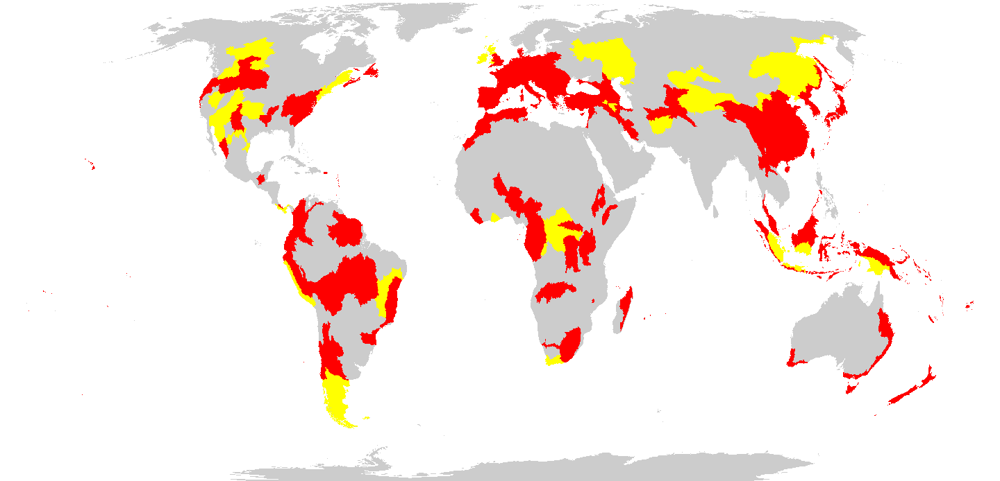

# Ecological traits

These riverine systems generally have low productivity and a relatively simple trophic structure, low species’ diversity but high endemism due to aquatic insularity. Many systems are highly dendritic, leading to species and generic differentiation even in nearby but separated streams. In temperate regions, there is often overhead tree canopy, with copious leaf fall, providing significant allochthonous subsidies to in situ primary production by phytoplankton and periphyton. Microbes and invertebrate shredders and detritivores break down leaf fall and other organic matter . Riparian zones may include large trees and other vegetation, drawing surface and groundwater from the upland river and reducing direct sunlight. Many organisms are specialised to live in high flow velocity environments. Biofilms of micro-organisms establish on rocks and process organic matter. Invertebrate functional groups include shredders, grazers, collectors, filter feeders and ambush predators. Filter feeders have traits adapted to turbulence, allowing them to hold fast to substrates while capturing resources. Fish have small body sizes. Birds with specialised foraging behaviours (e.g. dippers, kingfishers) are common in upland streams.

# Key-ecological-drivers

These streams have flow regimes with high velocity and relatively low but reliable perennial volume. They flow down moderate to steep slopes causing considerable erosion and sediment transport. These factors drive nutrient and organic matter transport downstream induce turbulence, and hence are highly oxygenated. Flow volume and variability depends on rainfall seasonality, snowmelt in or from cold-climate catchments, as well as catchment size.

# Distribution

In steep to moderate terrain throughout the humid tropical and temperate zones, rarely extending to boreal latitudes.

{:class="img-responsive"}

**Map details**: Freshwater ecoregions (Abell et al. 2008) containing major or minor occurrences of rivers and streams were identified by consulting available ecoregion descriptions (http://www.feow.org/),  global and regional reviews , maps of relevant ecosystems, and expertise of authors.

## References
### Text references
* Giller PS., Giller P., Malmqvist B (1998) The biology of streams and rivers. Oxford University Press, Oxford. / Meyer JL, Wallace JB (2001) Lost linkages and lotic ecology: rediscovering small streams. Blackwell, Oxford. / Meyer JL, Strayer DL, Wallace JB, Eggert SL, Helfman GS, Leonard NE (2007) The contribution of headwater streams to biodiversity in river networks. Journal of the American Water Resources Association 43:  86–103.
### Map References
* Abell R, Thieme ML, Revenga C, Bryer M, Kottelat M, Bogutskaya N, Coad B, Mandrak N, Contreras Balderas S, Bussing W, Stiassny MLJ, Skelton P, Allen GR, Unmack P, Naseka A, Ng R, Sindorf N, Robertson J, Armijo E, Higgins JV, Heibel TJ, Wikramanayake E, Olson D, López HL, Reis RE, Lundberg JG, Sabaj Pérez MH, Petry P (2008)Freshwater ecoregions of the world: A new map of biogeographic units for freshwater biodiversity conservation, BioScience 58: 403–414.
